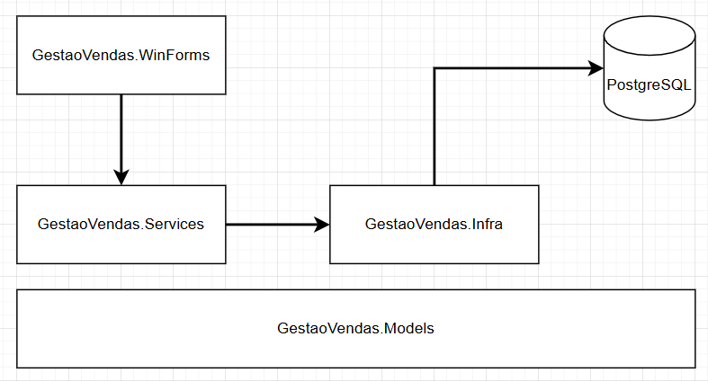
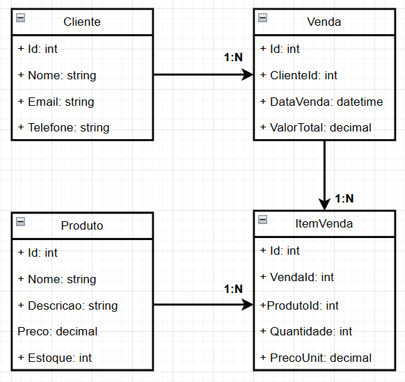

# Gestão de Vendas - Teste Técnico C# DeMaria

Este repositório contém a solução para o teste técnico de Desenvolvedor C# Pleno da empresa DeMaria. A aplicação é um sistema Desktop (Windows Forms) para gerenciamento de clientes, produtos e vendas, com foco em integridade de dados e arquitetura em camadas.

## Tecnologias Utilizadas
- **.NET 8.0** (C# Moderno)
- **Windows Forms** (Interface Gráfica)
- **PostgreSQL 16** (Banco de Dados)
- **Npgsql + Dapper** (Acesso a dados e Micro-ORM)
- **ReportViewer + RDLC** (Relatórios)
- **xUnit + Moq** (Testes Unitários e Mocks)

## Arquitetura e Padrões
O projeto foi estruturado seguindo o padrão de Arquitetura em Camadas para garantir a separação de responsabilidades:

1.  **GestaoVendas.Models:** Camada transversal contendo Entidades, DTOs e Interfaces. É o núcleo que não depende de ninguém.
2.  **GestaoVendas.Infra:** Responsável pelo acesso a dados (Repositórios). Utiliza **Dapper** para performance e **Npgsql** para conexão.
3.  **GestaoVendas.Services:** Contém as regras de negócio (ex: validação de estoque, cálculo de totais, regra de e-mail único).
4.  **GestaoVendas.WinForms:** Camada de apresentação. Responsável apenas por exibir dados e capturar eventos. Depende da camada de Serviços.
5.  **GestaoVendas.Tests:** Projeto de testes unitários isolados.

## Diagramas do Projeto

### Arquitetura da Solução


### Modelagem de Classes (Domínio)


### Decisões Técnicas
* **Injeção de Dependência (DI):** Foi implementada a injeção de dependência manual no `Program.cs` (Composition Root), garantindo que as classes sejam desacopladas e testáveis.
* **Transações de Banco (ACID):** A gravação de vendas utiliza `BeginTransaction` do PostgreSQL. Se houver falha ao inserir um item ou baixar estoque, toda a operação é desfeita (Rollback), garantindo integridade financeira.
* **Relatórios (XSD + RDLC):** Para contornar limitações de compatibilidade do Designer do Visual Studio 2022 com .NET 8, utilizou-se um DataSet tipado (.xsd) como fonte de dados para o ReportViewer, garantindo estabilidade no design.
* **Validações de Domínio:** Uso de exceções personalizadas (`DominioException`) para diferenciar erros de regra de negócio de erros de sistema.

---

## Configuração do Banco de Dados
Certifique-se de ter o PostgreSQL instalado.

1.  Crie um banco de dados chamado `GestaoVendasDB`.
2.  Execute o script abaixo para criar a estrutura:

```sql
-- 1. Tabela de CLIENTES
CREATE TABLE Clientes (
    Id SERIAL PRIMARY KEY,
    Nome VARCHAR(100) NOT NULL,
    Email VARCHAR(100) NOT NULL,
    Telefone VARCHAR(20),
    CONSTRAINT UQ_Cliente_Email UNIQUE (Email)
);

-- 2. Tabela de PRODUTOS
CREATE TABLE Produtos (
    Id SERIAL PRIMARY KEY,
    Nome VARCHAR(100) NOT NULL,
    Descricao TEXT,
    Preco DECIMAL(18, 2) NOT NULL,
    Estoque INT NOT NULL,
    CONSTRAINT CK_Produto_Preco CHECK (Preco > 0),
    CONSTRAINT CK_Produto_Estoque CHECK (Estoque >= 0)
);

-- 3. Tabela de VENDAS
CREATE TABLE Vendas (
    Id SERIAL PRIMARY KEY,
    ClienteId INT NOT NULL,
    DataVenda TIMESTAMP NOT NULL DEFAULT CURRENT_TIMESTAMP,
    ValorTotal DECIMAL(18, 2) NOT NULL DEFAULT 0,
    CONSTRAINT FK_Venda_Cliente FOREIGN KEY (ClienteId) REFERENCES Clientes(Id)
);

-- 4. Tabela de ITENS DA VENDA
CREATE TABLE ItensVenda (
    Id SERIAL PRIMARY KEY,
    VendaId INT NOT NULL,
    ProdutoId INT NOT NULL,
    Quantidade INT NOT NULL,
    PrecoUnitario DECIMAL(18, 2) NOT NULL,
    CONSTRAINT FK_Item_Venda FOREIGN KEY (VendaId) REFERENCES Vendas(Id) ON DELETE CASCADE,
    CONSTRAINT FK_Item_Produto FOREIGN KEY (ProdutoId) REFERENCES Produtos(Id),
    CONSTRAINT CK_Item_Quantidade CHECK (Quantidade > 0)
);
```

3. No arquivo GestaoVendas.Infra/Contexto/DbConexao.cs, ajuste a string de conexão com sua senha: "Server=localhost;Port=5432;Database=GestaoVendasDB;User Id=postgres;Password=SUA_SENHA;".

## Como Executar
1. Clone este repositório.

2. Abra o arquivo GestaoVendas.sln no Visual Studio 2022.

3. Recompile a solução (Build) para restaurar os pacotes NuGet.

4. Defina o projeto GestaoVendas.WinForms como projeto de inicialização (Set as Startup Project).

5. Pressione F5.

## Como Rodar os Testes
1. Abra o Gerenciador de Testes (Menu Teste -> Gerenciador de Testes).

2. Clique em "Executar Todos".

O projeto contém testes unitários cobrindo as principais regras de negócio da Venda (cálculo de totais e validação de itens), utilizando Moq para simular o banco de dados.

Autor: João Lucas Antunes
